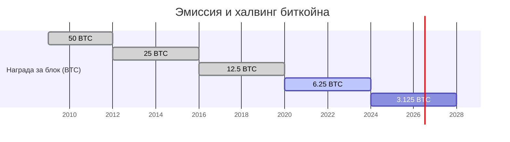
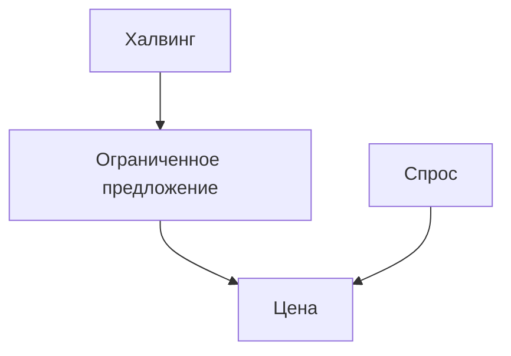

# Теория биткойна

Биткойн — децентрализованная цифровая валюта с фиксированным предложением 21 млн монет. Его денежная политика запрограммирована в протоколе и не зависит от решений отдельного эмитента.

## Эмиссия и халвинг

Эмиссия биткойна снижается каждые ~210 000 блоков (примерно раз в четыре года). Это событие называется **халвингом** и уменьшает награду майнера за блок вдвое.

По мере уменьшения награды темпы выпуска новых монет падают, и общий объём циркулирующего предложения стремится к 21 млн.

## Спрос и предложение

Цена биткойна формируется на рынке под воздействием спроса и ограниченного предложения. Структуру можно представить схематично:

Рост спроса при фиксированном предложении приводит к повышению цены, тогда как снижение спроса — к коррекциям. Халвинги сокращают скорость эмиссии и смещают кривую предложения, усиливая дефицит и потенциально поддерживая долгосрочный рост стоимости.
