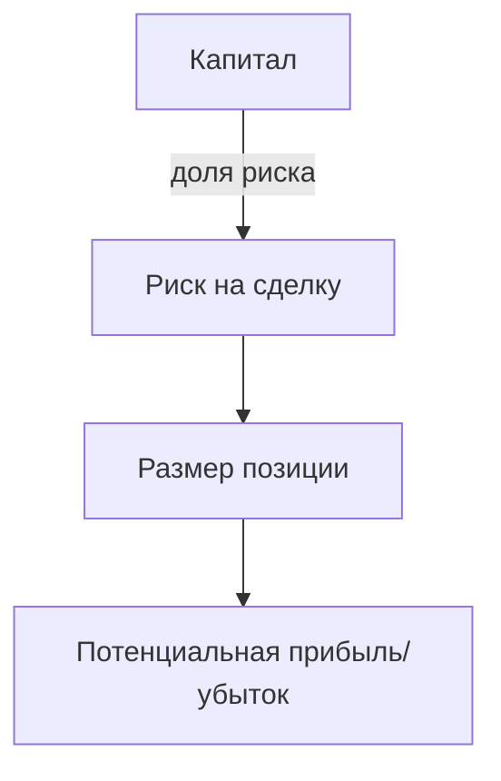

# Основы трейдинга

Этот документ знакомит с базовыми концепциями трейдинга, необходимыми для работы с CryptoIA.

## Рыночные циклы

Рынок криптовалют движется циклически: периоды накопления сменяются ростом, затем распределением и коррекцией.


Понимание фазы цикла помогает выбрать стратегию: в накоплении уместны покупки, в распределении — фиксация прибыли.

## Риск-менеджмент

Управление риском определяет выживаемость трейдера. Базовый принцип — ограничивать потенциальный убыток в каждой сделке.



Пример расчёта размера позиции:

```
размер = капитал × риск_на_сделку ÷ дистанция_до_SL
```

Грамотный риск-менеджмент и дисциплина позволяют пережить затяжные просадки и использовать преимущества рыночных циклов.
